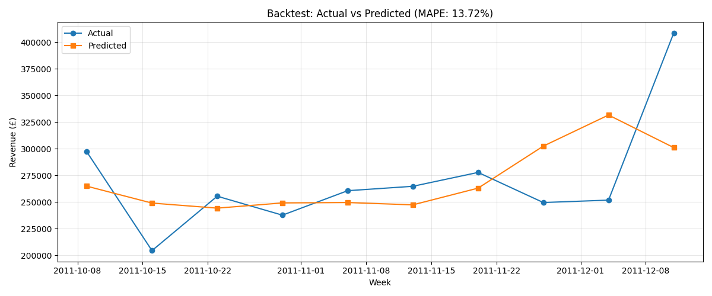
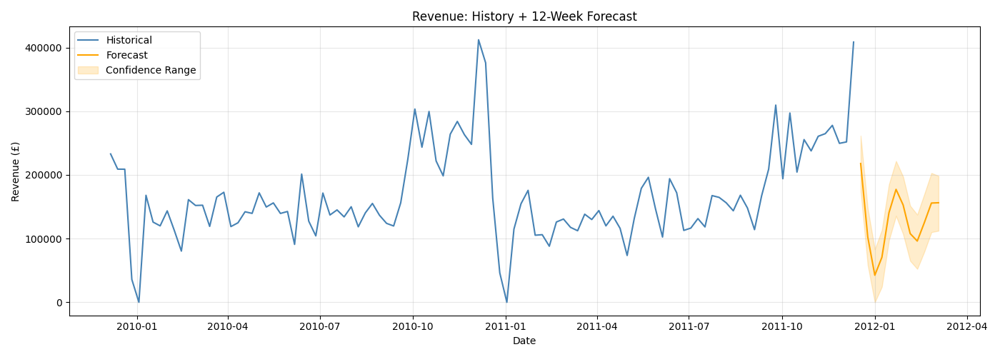
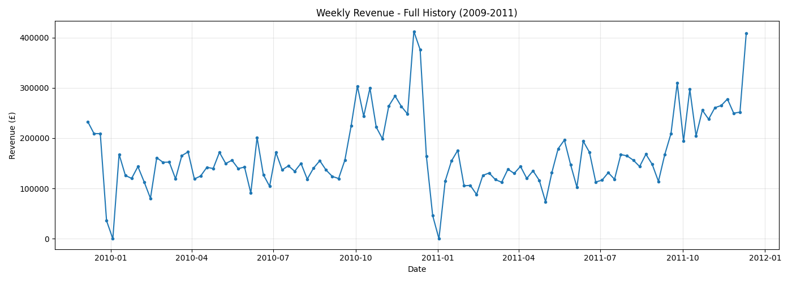
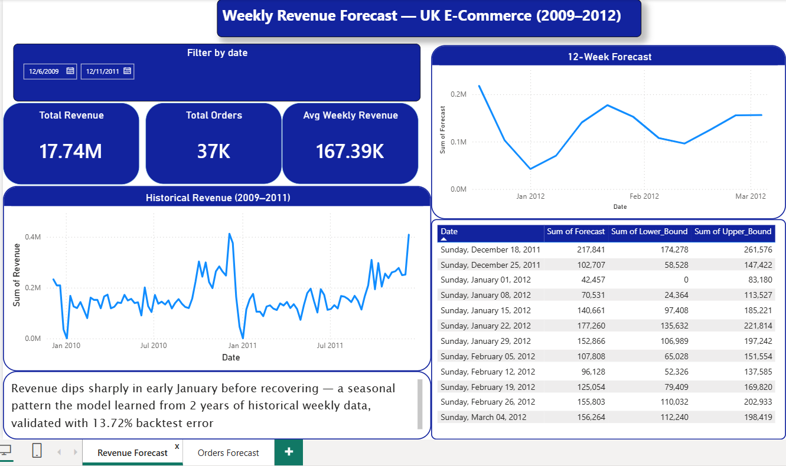
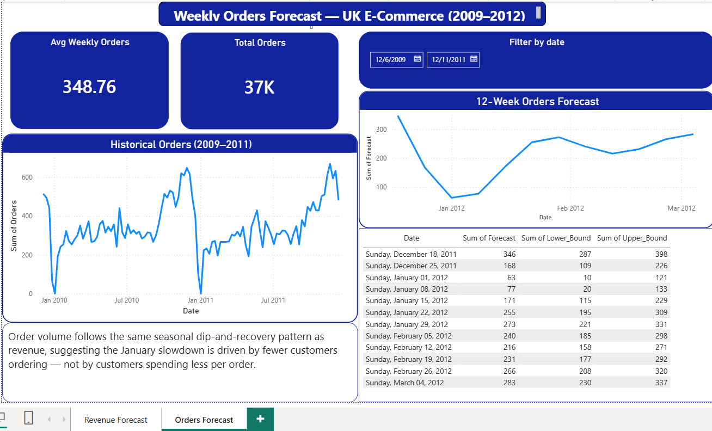

# UK E-Commerce Weekly Revenue & Orders Forecast

A time-series forecasting project built on ~1 million real transaction records from the [UCI Online Retail II dataset](https://archive.ics.uci.edu/dataset/502/online+retail+ii) — a UK-based online retailer's sales from December 2009 to December 2011. The project forecasts weekly revenue and order volume 12 weeks into the future using Facebook Prophet, validated against real held-out data, and presented in an interactive Power BI dashboard.

## Summary

Built a weekly revenue and orders forecasting model on 2 years of real UK e-commerce transaction data, validated it against held-out actuals (**13.72% backtest error**), and used it to project both revenue and order volume 12 weeks ahead — then compared the two forecasts to identify what's actually driving the seasonal swings.

## The data

Raw data: ~1.07M line-item transactions, 8 columns (Invoice, StockCode, Description, Quantity, InvoiceDate, Price, Customer ID, Country), spanning Dec 2009 – Dec 2011.

Cleaning steps:
- Removed returns (negative quantities) and cancelled orders
- Removed rows with missing Customer IDs
- Removed data errors — zero or negative prices
- Aggregated to weekly totals (revenue and order counts)

## Key decision: daily vs. weekly aggregation

Daily revenue was too noisy to forecast reliably — a single large order could swing a day's total by 10x. Testing a daily model produced a 22% error rate. Switching to weekly aggregation smoothed that noise and cut the error to 13.72% — the kind of iterative, evidence-based adjustment that mattered more than just picking a model.

## Validation

Before trusting any future prediction, the model was validated with a proper backtest: trained only on data up to a cutoff point, then checked against the actual weekly revenue that followed.

**Result: 13.72% MAPE (Mean Absolute Percentage Error)** across the held-out weeks.

## The forecast

With the model validated, it was retrained on the full 2 years of data and used to forecast 12 weeks ahead — for both **revenue** and **order volume** — with upper/lower confidence bounds rather than a single-point guess.

## The insight

Comparing the revenue forecast to the orders forecast side by side, both follow **the same seasonal dip-and-recovery shape** — a sharp drop in early January, a partial recovery, a second smaller dip in mid-February, then climbing back up by March.

That similarity is the finding: **the January revenue slowdown is driven by fewer customers ordering, not by customers spending less per order.** Revenue and order volume move together almost exactly, which tells a business exactly where to focus — customer acquisition/retention around the holiday drop-off, not pricing or basket size.

## Dashboard

Built in Power BI — two pages, a synced date-range slicer, KPI cards, historical + forecast charts side by side, and a clean forecast table with confidence bounds for both revenue and orders.

**Page 1 — Revenue Forecast**

**Page 2 — Orders Forecast**

## Business impact

A retail or e-commerce company could use this to plan inventory, staffing, and cash flow ahead of predictable busy or slow periods instead of reacting after the fact — and use the revenue-vs-orders comparison to decide whether a slowdown calls for a marketing push (more customers) or a pricing/upsell strategy (bigger baskets).

## Tools

- **Python** (pandas, Prophet) — data cleaning, weekly aggregation, forecasting, backtesting
- **Power BI** — interactive two-page dashboard with synced slicer

## Files

| File | Description |
|---|---|
| `uk-ecommerce-revenue-forecast.ipynb` | Full notebook — cleaning, weekly aggregation, Prophet model, backtest, forecast export |
| `uk-ecommerce-revenue-forecast.pbix` | Power BI dashboard (2 pages) |
| `weekly_historical_data.csv` | Cleaned weekly revenue + order totals, 2009–2011 |
| `weekly_revenue_forecast.csv` | 12-week revenue forecast with confidence bounds |
| `weekly_orders_forecast.csv` | 12-week orders forecast with confidence bounds |
| `backtest_results.csv` | Actual vs. predicted values from the validation backtest |
| `Screenshots/` | Dashboard pages and model output charts |
